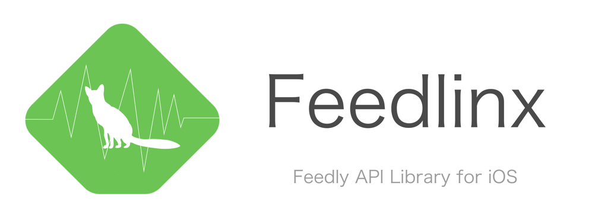

# Feedlinx




[](https://travis-ci.org/hirano_tomoya/Feedlinx)
[](http://cocoapods.org/pods/Feedlinx)
[](http://cocoapods.org/pods/Feedlinx)
[](http://cocoapods.org/pods/Feedlinx)

## Usage

To run the example project, clone the repo, and run `pod install` from the Example directory first.

## Requirements

## Installation

Feedlinx is available through [CocoaPods](http://cocoapods.org). To install
it, simply add the following line to your Podfile:

```ruby
pod "Feedlinx"
```

## Author

http://twitter.com/noppefoxwolf

## License

Feedlinx is available under the MIT license. See the LICENSE file for more info.
